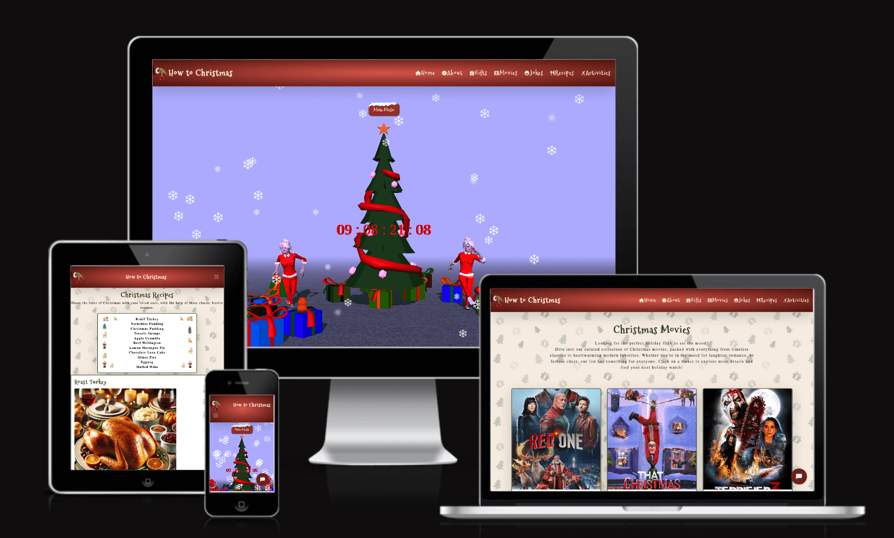
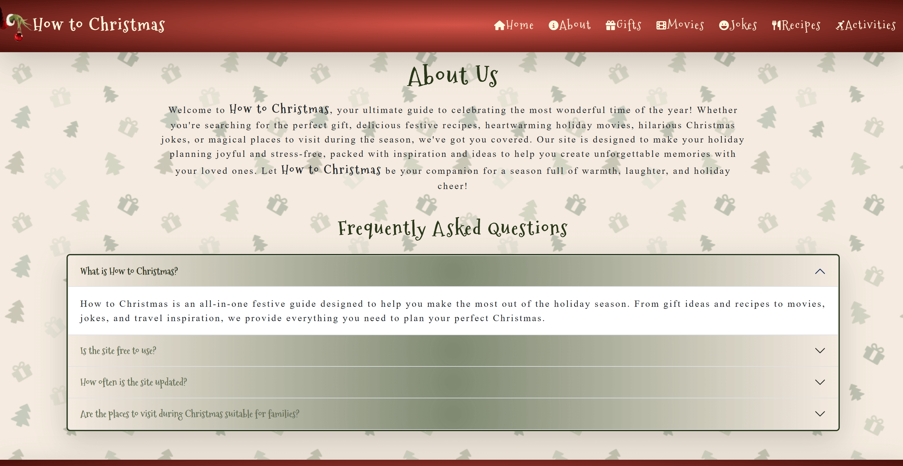
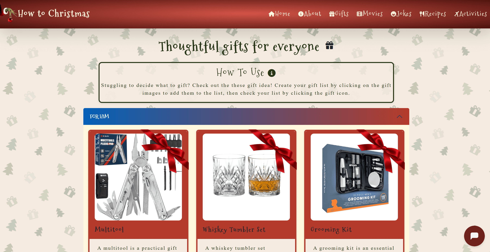
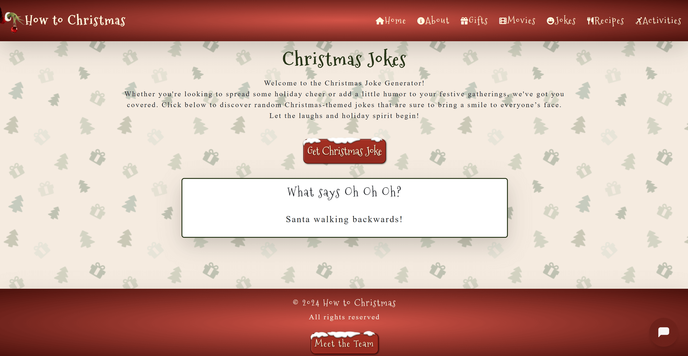
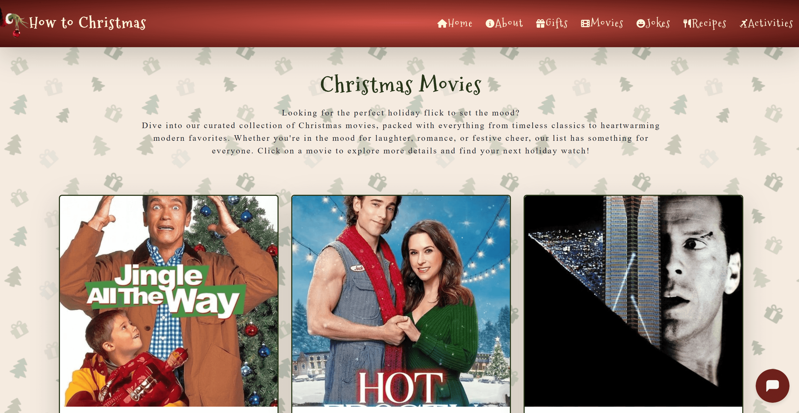
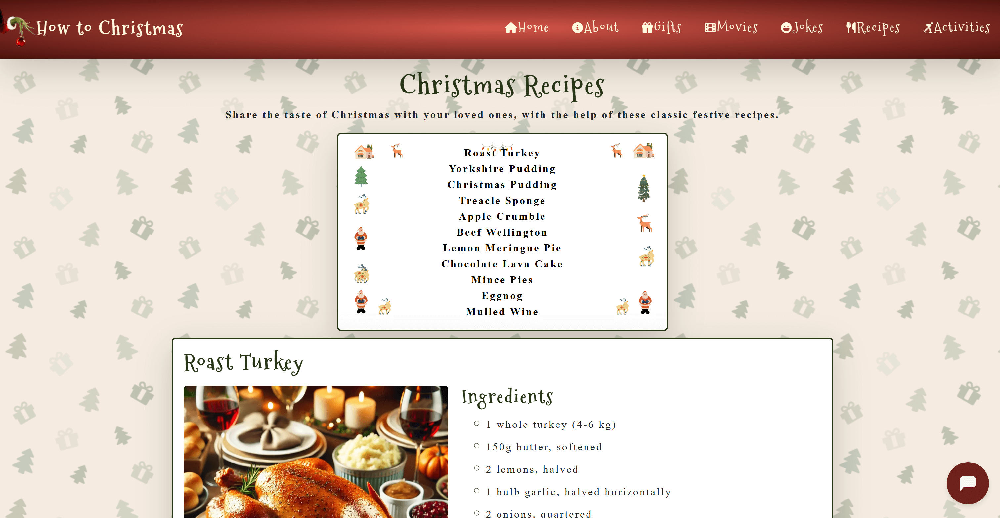
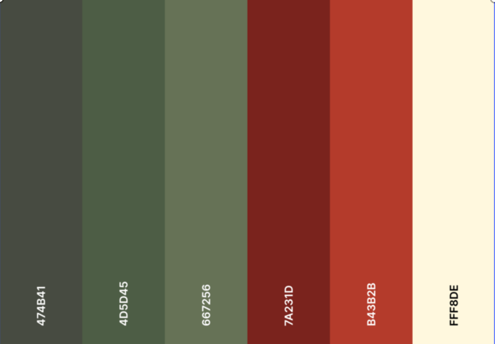

# 
# 🎅✨ Hack the Holidays! 🎄🎁 

# 🎄🎁 How to Christmas 🎄🎁

## **🎄 Hack the Holidays: Submission Details**  

### **Deployment**   
The project is deployed and can be accessed at: https://kelvinc181.github.io/How-To-Christmas/

The team's kanban board: https://github.com/users/KelvinC181/projects/9

---

### **Criteria**  
In this section, we will briefly discuss how our team addressed the applicable criteria:  
- 🎁 **The project fits the theme of celebrating the holidays.**

The "How to Christmas" project is a perfect fit for the holiday theme, serving as a comprehensive guide to celebrating Christmas. It includes features like a recipe page, gift suggestions, activities page (with indoor, outdoor, and family-friendly options), and even a jokes generator to spread holiday cheer. The inclusion of an AI-generated Christmas song on the homepage highlights the festive atmosphere and adds a unique touch.

- 🎁 **The project is well planned and executed (Using GitHub Projects/Kanban).**

The team demonstrated strong organizational skills by utilizing GitHub Projects for task management, as well as Slack for instant replies, decision making and help when needed. A Kanban-style board was used to track progress, assign responsibilities, and ensure deadlines were met. This structured approach facilitated collaboration, ensured transparency, and allowed the team to deliver the project efficiently.

- 🎁 **The project has a basic README that follows the provided template.**

The README adheres to the template provided and is clear, concise, and informative. It includes:

- An overview of the project and its features.
- Links to the deployed project and relevant resources.
- A section outlining team members and credits.
 
- 🎁 **The project has an overall sense of completeness.**

The project feels complete and polished, with every feature contributing to the user experience:

- The gift suggestions provide actionable ideas for holiday shopping.
- The recipe page ensures users can plan festive meals.
- The activities page encourages family bonding through curated options.
- The jokes generator adds a layer of fun and whimsy.
- The design is cohesive, the navigation is user-friendly, and the content is rich, ensuring users feel supported in every aspect of holiday planning.

- 🎁 **The project showcases a strong sense of creativity and originality.**

The project's originality shines through its diverse features and playful tone:

- The inclusion of an AI-generated Christmas song is an innovative way to engage users.
- The activities page is uniquely tailored to different holiday scenarios.
- The jokes generator adds humor, making the project both practical and entertaining.
- Thoughtful design choices, like festive colors and a snow effect, elevate the user experience and reflect the spirit of the season.
- The blend of functionality, creativity, and festive cheer makes this project stand out.  

---

## **🎅 About the Submission**  

### **Intro**  
Welcome to How to Christmas, your ultimate guide to making the most of the holiday season! Whether you’re looking for the perfect gift ideas, festive recipes to wow your guests, or creative activities to bring family and friends together, we’ve got you covered. Our site is packed with inspiration and practical tips to help you create unforgettable Christmas memories, no matter how you celebrate.

Dive into our unique features, like the AI-generated Christmas song that sets the perfect festive tone, or laugh out loud with our joke generator. Explore indoor and outdoor activities for all ages, discover thoughtful gift suggestions, and whip up holiday magic in the kitchen with our curated recipes. At How to Christmas, we’re here to add a sprinkle of joy, creativity, and holiday cheer to your celebrations. Let’s make this Christmas your most magical one yet!  

---
  

### **Goal**  
The **Goal** section provides a concise summary of the main objective or purpose of the project described in this README. It addresses the following aspects:  

- 🎄 **Problem Statement:**

The holiday season is often filled with joy but can also be stressful when it comes to planning and preparation. Finding unique gift ideas, organizing festive activities, and bringing everyone together can feel overwhelming. There’s a gap in easily accessible, centralized resources to help individuals and families plan their Christmas celebrations, making it both magical and manageable.

- 🎄 **Objective(s):**

Our project aims to provide a comprehensive holiday planning guide that makes Christmas more joyful and less stressful. Key objectives include:

Offering creative and thoughtful gift ideas to simplify holiday shopping.
Providing recipes to inspire festive feasts.
Suggesting indoor, outdoor, and family-friendly activities to create memorable moments.
Generating Christmas-themed jokes to add a touch of humor and joy.
Featuring an AI-generated Christmas song to set the perfect festive tone.

- 🎄 **Target Audience:**

The project is designed for:

Families and friends looking to plan a stress-free holiday together.
Individuals in need of inspiration for gifts, meals, or activities.
Holiday enthusiasts who enjoy exploring unique and creative ways to celebrate Christmas.
Users of all ages, from children to adults, who want to enjoy the festive season with fewer hassles.

- 🎄 **Benefits:**

- Simplifies holiday planning: The site centralizes ideas for gifts, activities, and recipes, making it a one-stop resource.
- Fosters joy and connection: Through fun features like the jokes generator and activities page, the project encourages bonding and laughter.
- Enhances creativity: Inspiring unique ways to celebrate, it helps users create unforgettable memories.
- Accessible and inclusive: The diverse content caters to different needs, preferences, and age groups, ensuring everyone can find something they love.
- Celebrates the season: With its festive design, AI-generated song, and thoughtful features, it embodies the spirit of Christmas, making the holidays brighter and more meaningful.

---

## Pages

### Home Page

### About Page

### Gifts Page

### Jokes Page

### Movies Page

### Recipes Page

---

#### Colour

The color palette was thoughtfully designed to evoke the festive warmth of the holiday season while maintaining a connection to nature's charm. Dark red (#7a231d) serves as the primary color, symbolizing passion, tradition, and the cozy essence of Christmas. Medium dark green (#4d5d45) represents the evergreen trees, embodying growth, renewal, and a deep connection to nature. Light yellow (#fff8de) offers a soft, welcoming glow, reminiscent of candlelight and holiday warmth. Very light cream (#f5ebe0) provides a gentle, neutral backdrop, adding a sense of comfort and refinement. Dark green (#474b41) anchors the design with stability and elegance, echoing the deep, rich tones of a winter forest. Red (#b43b2b) adds a festive, vibrant touch, enhancing the celebratory feel of the palette. Light dark green (#667256) introduces a subtle contrast, representing the natural beauty of winter foliage with sophistication.

---
## **💻 Tech Stack**  
- Frontend: HTML, CSS, JavaScript  
- Version Control: Git & GitHub  
- Deployment: Github Pages
- Bootstrap CDN - linked as per [Bootstrap docs](https://getbootstrap.com/docs/5.3/getting-started/introduction/)
- [Font Awesome CDN](https://cdnjs.com/libraries/font-awesome)
- [Google Fonts](https://fonts.google.com)
- ThreeJS: https://threejs.org/

---

## Credit

- The recipe page's ingredients and instructions text and accompanying images were generated with ChatGPT.
- The HTML, CSS, and JavaScript for the recipe page's 'scroll to top' button were sourced from [a W3Schools page](https://www.w3schools.com/howto/howto_js_scroll_to_top.asp). 
- Tavern In Snow: https://sketchfab.com/3d-models/tavern-in-snow-f999dd375bce43a0bd1bcfe218a550a7
- Christmas button: https://codepen.io/TackOnes1/pen/MaLQjr
- Snowflakes: https://codepen.io/siddharth-nalwaya/pen/wvXZqbq
- Christmas jokes: https://github.com/marcyvillegas/random-joke-generator/tree/main, https://sv443.net/jokeapi/v2/#categories
- Homepage hero css gradient: https://gradient.page/ui-gradients/christmas
- Pattern - https://patternico.com/
- AI music generator - https://aisonggenerator.io/
- Models: https://sketchfab.com

Team:
- Kelvin Chan - https://github.com/KelvinC181
- Jaimie Hemmings - https://github.com/JaimieHemmings
- Viola Bergere - https://github.com/violaberg
- Noah Samawi - https://github.com/Noah-Samawi
- Carrick Entwistle - https://github.com/CARRIXK
- Karol Suszek - https://github.com/KarolSU96
- Niall Caplis - https://github.com/niall-code