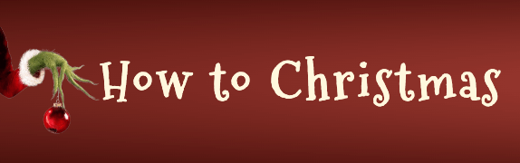
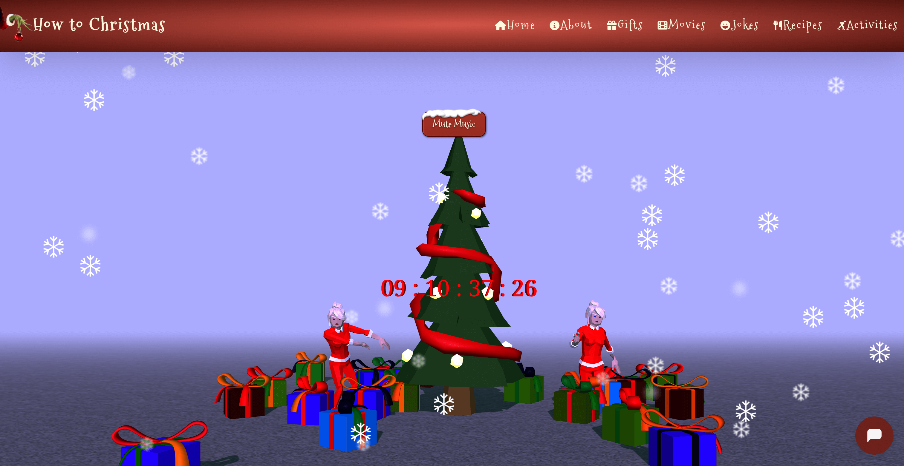

# 
# 🎅✨ Hack the Holidays! 🎄🎁 

# 🎄🎁 How to Christmas 🎄🎁

## **🎄 Hack the Holidays: Submission Details**  

### **Deployment**   
The project is deployed and can be accessed at: https://kelvinc181.github.io/How-To-Christmas/

The team's kanban board: https://github.com/users/KelvinC181/projects/9

---

### **Criteria**  
In this section, we will briefly discuss how our team addressed the applicable criteria:  
- 🎁 **The project fits the theme of celebrating the holidays.**  
- 🎁 **The project is well planned and executed (Using GitHub Projects/Kanban).**  
- 🎁 **The project has a basic README that follows the provided template.**  
- 🎁 **The project has an overall sense of completeness.**  
- 🎁 **The project showcases a strong sense of creativity and originality.**  

---

## **🎅 About the Submission**  

### **Intro**  
Welcome to How to Christmas, your ultimate guide to making the most of the holiday season! Whether you’re looking for the perfect gift ideas, festive recipes to wow your guests, or creative activities to bring family and friends together, we’ve got you covered. Our site is packed with inspiration and practical tips to help you create unforgettable Christmas memories, no matter how you celebrate.

Dive into our unique features, like the AI-generated Christmas song that sets the perfect festive tone, or laugh out loud with our joke generator. Explore indoor and outdoor activities for all ages, discover thoughtful gift suggestions, and whip up holiday magic in the kitchen with our curated recipes. At How to Christmas, we’re here to add a sprinkle of joy, creativity, and holiday cheer to your celebrations. Let’s make this Christmas your most magical one yet!  

---
  

### **Goal**  
The **Goal** section provides a concise summary of the main objective or purpose of the project described in this README. It addresses the following aspects:  

- 🎄 **Problem Statement:** A brief description of the holiday-related issue or gap our project aims to address.  
- 🎄 **Objective(s):** What does our project set out to achieve?  
- 🎄 **Target Audience:** Who will benefit from this project?  
- 🎄 **Benefits:** How will this project make the holidays brighter, more inclusive, or more joyful?  

---

## Pages

### Home Page

### About Page

### Gifts Page

### Jokes Page

### Movies Page

### Recipes Page

---

#### Colour

The color palette was thoughtfully designed to evoke the festive warmth of the holiday season while maintaining a connection to nature's charm. Dark red (#7a231d) serves as the primary color, symbolizing passion, tradition, and the cozy essence of Christmas. Medium dark green (#4d5d45) represents the evergreen trees, embodying growth, renewal, and a deep connection to nature. Light yellow (#fff8de) offers a soft, welcoming glow, reminiscent of candlelight and holiday warmth. Very light cream (#f5ebe0) provides a gentle, neutral backdrop, adding a sense of comfort and refinement. Dark green (#474b41) anchors the design with stability and elegance, echoing the deep, rich tones of a winter forest. Red (#b43b2b) adds a festive, vibrant touch, enhancing the celebratory feel of the palette. Light dark green (#667256) introduces a subtle contrast, representing the natural beauty of winter foliage with sophistication.

---
## **💻 Tech Stack**  
- Frontend: HTML, CSS, JavaScript  
- Version Control: Git & GitHub  
- Deployment: Github Pages
- Bootstrap CDN - linked as per [Bootstrap docs](https://getbootstrap.com/docs/5.3/getting-started/introduction/)
- [Font Awesome CDN](https://cdnjs.com/libraries/font-awesome)
- [Google Fonts](https://fonts.google.com)
- ThreeJS: https://threejs.org/

---

## Credit

- The recipe page's ingredients and instructions text and accompanying images were generated with ChatGPT.
- The HTML, CSS, and JavaScript for the recipe page's 'scroll to top' button were sourced from [a W3Schools page](https://www.w3schools.com/howto/howto_js_scroll_to_top.asp). 
- Tavern In Snow: https://sketchfab.com/3d-models/tavern-in-snow-f999dd375bce43a0bd1bcfe218a550a7
- Christmas button: https://codepen.io/TackOnes1/pen/MaLQjr
- Snowflakes: https://codepen.io/siddharth-nalwaya/pen/wvXZqbq
- Christmas jokes: https://github.com/marcyvillegas/random-joke-generator/tree/main, https://sv443.net/jokeapi/v2/#categories
- Homepage hero css gradient: https://gradient.page/ui-gradients/christmas
- Pattern - https://patternico.com/
- AI music generator - https://aisonggenerator.io/
- Models: https://sketchfab.com

Team:
- Kelvin Chan - https://github.com/KelvinC181
- Jaimie Hemmings - https://github.com/JaimieHemmings
- Viola Bergere - https://github.com/violaberg
- Noah Samawi - https://github.com/Noah-Samawi
- Carrick Entwistle - https://github.com/CARRIXK
- Karol Suszek - https://github.com/KarolSU96
- Niall Caplis - https://github.com/niall-code